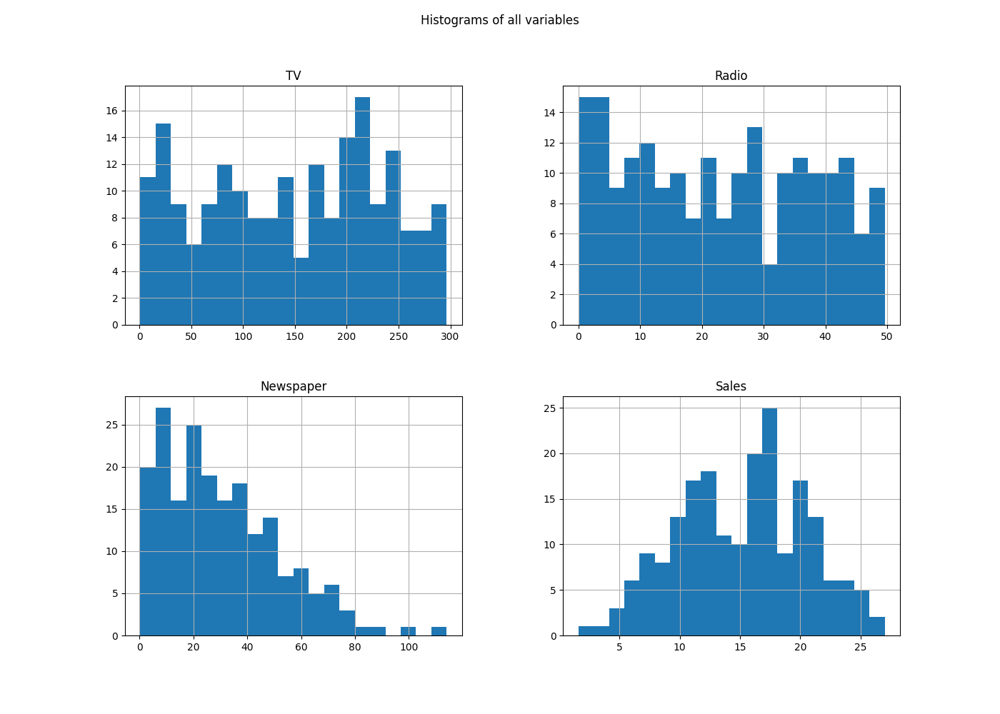
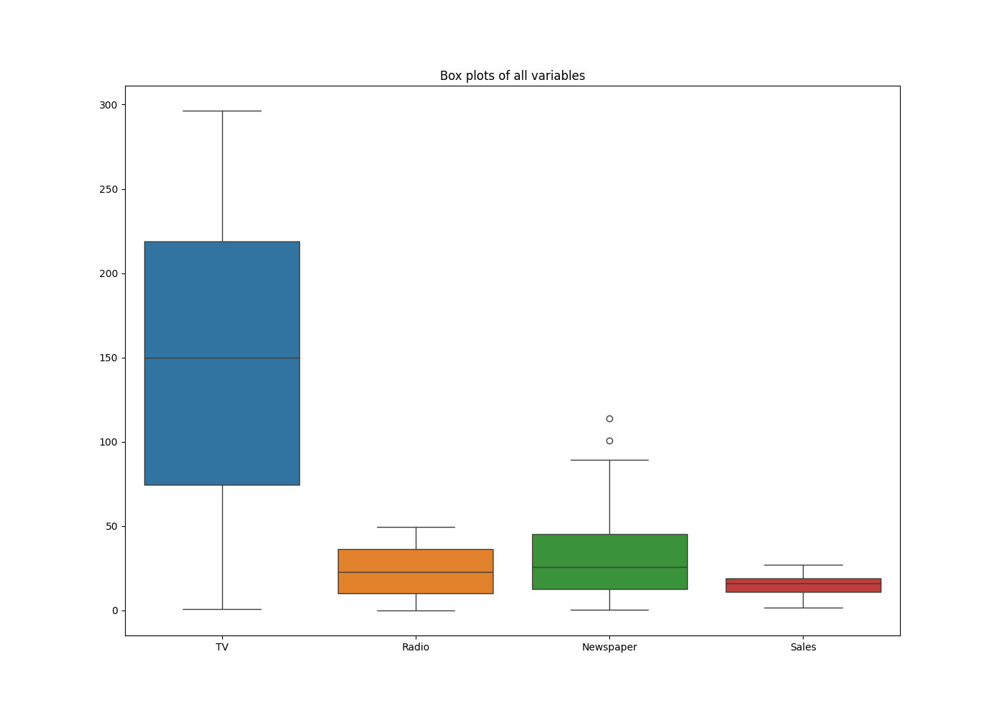
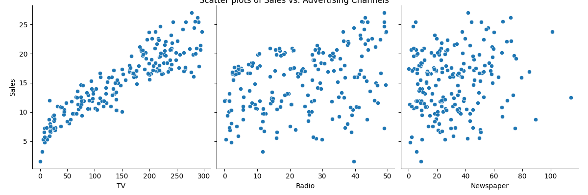
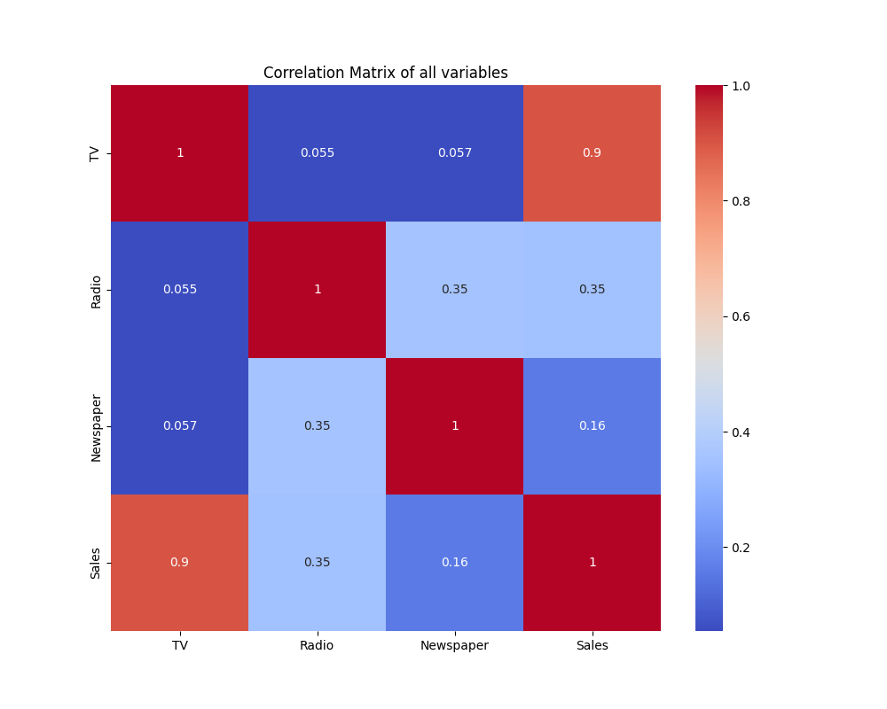
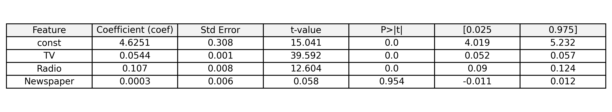

# Marketing Spend Optimization & Sales Forecasting

This project aims to build an econometric model to predict sales based on marketing spend.

## Introduction

**What is this project about?**

This project aims to understand the relationship between advertising spend on different channels (TV, Radio, and Newspaper) and sales. We use econometric techniques to build a predictive model that can not only forecast sales but also help in optimizing the advertising budget.

**Why is it important?**

In today's competitive market, it's crucial for businesses to understand the effectiveness of their marketing campaigns. By analyzing the data, we can identify which advertising channels are providing the best return on investment and make data-driven decisions to maximize sales.

## Project Structure

The project is now organized into a clean and logical directory structure to enhance navigability and maintainability:

-   **`data/`**: Contains the raw dataset (`advertising.csv`).
-   **`notebooks/`**: Houses all Jupyter notebooks (`.ipynb` files) used for exploratory data analysis, predictive modeling, and comprehensive analysis.
-   **`plots/`**: Stores all generated image files (`.png`) from the data visualization steps.
-   **`scripts/`**: Contains Python scripts (`.py` files) for various tasks such as data loading, exploratory analysis, and regression modeling.
-   **Root Directory**: The main directory contains essential project files like this `README.md`, `.gitignore`, and `requirements.txt`.

## Dataset

The dataset used in this project is `advertising.csv`, which contains data on advertising spend across different channels and the corresponding sales.

## Model

The project will use a regression model to predict sales.

## Exploratory Data Analysis Visualizations

This section presents key visualizations generated during the exploratory data analysis phase, offering insights into the dataset's distributions and relationships.

### Histograms of Variables

These histograms show the distribution of spending on TV, Radio, and Newspaper advertising, as well as the distribution of Sales.

### Box Plots of Variables

Box plots illustrate the spread and central tendency of each variable, helping to identify outliers and understand data variability.

### Scatter Plots of Sales vs. Advertising Channels

These plots visualize the relationship between advertising spend on TV, Radio, and Newspaper, and their corresponding impact on Sales. They help in identifying linear relationships and potential correlations.

### Correlation Matrix Heatmap

This heatmap displays the correlation coefficients between all variables in the dataset, providing a quick overview of the strength and direction of linear relationships.

## 1. Data Exploration and Preprocessing

We started by loading the `advertising.csv` dataset and examining its structure. The dataset contains 200 rows and 4 columns: `TV`, `Radio`, `Newspaper`, and `Sales`. There are no missing values in the dataset. This analysis is primarily performed in the `scripts/exploratory_analysis.py` script and the `notebooks/Exploratory_Data_Analysis.ipynb` notebook.

## 2. Correlation Analysis

**What is Correlation?**
Correlation measures the strength and direction of a linear relationship between two variables. A correlation coefficient (like Pearson's r) ranges from -1 to +1.
-   **+1:** Perfect positive linear relationship (as one variable increases, the other increases proportionally).
-   **-1:** Perfect negative linear relationship (as one variable increases, the other decreases proportionally).
-   **0:** No linear relationship.

**Why is it important?**
Understanding correlations helps us identify which advertising channels have a stronger linear association with sales, providing initial insights into their potential effectiveness.

**How it's used in this project:**
We calculated the Pearson correlation coefficient between each advertising channel (TV, Radio, Newspaper) and Sales. This was visualized using a heatmap of the correlation matrix.

**Results:**
The correlation matrix shows the following relationships:

*   **TV and Sales (0.901):** This indicates a very strong positive linear correlation. As TV advertising spend increases, sales tend to increase significantly.
*   **Radio and Sales (0.350):** This shows a weak to moderate positive linear correlation. Radio advertising also contributes positively to sales.
*   **Newspaper and Sales (0.228):** This suggests a weak positive linear correlation. Newspaper advertising has a negligible linear relationship with sales compared to TV and Radio.

These results suggest that TV and Radio advertising are likely better predictors for Sales than Newspaper advertising. The correlation analysis can be found in `scripts/exploratory_analysis.py` and `notebooks/Exploratory_Data_Analysis.ipynb`.

## 3. Hypothesis Testing

**What is Hypothesis Testing?**
Hypothesis testing is a statistical method used to make inferences about a population based on a sample of data. It involves formulating a null hypothesis (H0) and an alternative hypothesis (H1), collecting data, and then using statistical tests to determine whether there is enough evidence to reject the null hypothesis.

**Why is it important?**
In econometric modeling, hypothesis testing helps us determine if the relationships observed between variables in our sample data are statistically significant and likely to hold true for the larger population. It helps us avoid drawing conclusions based on random chance.

**How it's used in this project:**
We performed hypothesis tests on the coefficients of our regression model to determine the statistical significance of each advertising channel's impact on sales. Specifically, we looked at the p-value associated with each coefficient.

**Hypotheses for each coefficient (e.g., for TV advertising):**
*   **Null Hypothesis (H0):** There is no linear relationship between TV advertising spend and Sales (i.e., the coefficient for TV is zero).
*   **Alternative Hypothesis (H1):** There is a linear relationship between TV advertising spend and Sales (i.e., the coefficient for TV is not zero).

**Results (from the regression model summary):**
For each advertising channel, a t-test is performed, and a p-value is calculated.

*   **TV (p-value ≈ 0.000):** The p-value for TV advertising is extremely small (close to zero). Since this p-value is much less than the conventional significance level (alpha = 0.05), we **reject the null hypothesis**. This means there is strong statistical evidence to conclude that TV advertising has a significant linear relationship with Sales.
*   **Radio (p-value ≈ 0.000):** Similarly, the p-value for Radio advertising is very small. We **reject the null hypothesis**, indicating a statistically significant linear relationship between Radio advertising and Sales.
*   **Newspaper (p-value = 0.860):** The p-value for Newspaper advertising is very high (0.860). Since this p-value is much greater than 0.05, we **fail to reject the null hypothesis**. This implies that there is no statistically significant linear relationship between Newspaper advertising and Sales in this model.

This analysis is detailed in the `notebooks/Predictive_Modeling.ipynb` notebook.

## 4. Regression Modeling, Evaluation, and Interpretation

**What is Multiple Linear Regression?**
Multiple Linear Regression is a statistical technique used to model the linear relationship between a dependent variable (in our case, Sales) and two or more independent variables (TV, Radio, Newspaper advertising spend). The goal is to find the best-fitting linear equation that predicts the dependent variable based on the independent variables.

The general form of the multiple linear regression equation is:
`Sales = β₀ + β_TV * TV + β_Radio * Radio + β_Newspaper * Newspaper + ε`
Where:
-   `Sales`: The dependent variable.
-   `β₀`: The intercept, representing the baseline sales when all advertising spend is zero.
-   `β_TV`, `β_Radio`, `β_Newspaper`: The coefficients for TV, Radio, and Newspaper advertising, respectively. These represent the change in Sales for a one-unit increase in the corresponding advertising spend, holding other advertising channels constant.
-   `TV`, `Radio`, `Newspaper`: The independent variables representing advertising spend in each channel.
-   `ε`: The error term, representing the unexplained variance or noise in the model.

**Why is it important?**
Regression modeling allows us to quantify the impact of each advertising channel on sales, predict future sales based on advertising budgets, and identify the most effective channels for investment.

**How it's used in this project:**
We built a multiple linear regression model using the `statsmodels` library in Python. The model predicts `Sales` based on `TV`, `Radio`, and `Newspaper` advertising spend.

**Model Summary and Key Metrics:**
The model summary from the `notebooks/Predictive_Modeling.ipynb` notebook provides several key metrics for evaluating the model's performance and the significance of its components:

*   **R-squared (0.903) and Adjusted R-squared (0.901):**
    *   **What they mean:** R-squared measures the proportion of the variance in the dependent variable (Sales) that can be predicted from the independent variables (advertising spend). Adjusted R-squared is a modified version that accounts for the number of predictors in the model, providing a more accurate measure for models with multiple independent variables.
    *   **Interpretation:** An R-squared value of 0.903 indicates that approximately 90.3% of the variation in Sales can be explained by the advertising spend on TV, Radio, and Newspaper. This is a very high value, suggesting that our model is a good fit for the data. The adjusted R-squared being very close to R-squared suggests that the included predictors are valuable and not just adding noise.

*   **F-statistic (605.4) and its p-value (≈ 8.13e-99):**
    *   **What they mean:** The F-statistic is used to test the overall significance of the regression model. It compares the fit of the model with predictors to the fit of a model with no predictors. The p-value associated with the F-statistic tells us the probability of observing such an F-statistic if the null hypothesis (that all regression coefficients are zero) were true.
    *   **Interpretation:** A very large F-statistic (605.4) and an extremely small p-value (close to zero, specifically 8.13e-99) indicate that the overall regression model is statistically significant. This means that at least one of the advertising channels has a significant linear relationship with Sales.

*   **Coefficients (β) and their p-values (t-test):**
    *   **What they mean:** The coefficients represent the estimated change in Sales for a one-unit increase in the corresponding advertising spend, holding other advertising spends constant. The p-value for each coefficient (from a t-test) indicates the statistical significance of that individual predictor.
    *   **Interpretation:**
        *   **TV (Coefficient: 0.0544, p-value ≈ 0.000):** For every £1 increase in TV advertising spend, Sales are expected to increase by approximately 0.0458 units, holding Radio and Newspaper spend constant. The very low p-value indicates this relationship is highly statistically significant.
        *   **Radio (Coefficient: 0.1070, p-value ≈ 0.000):** For every £1 increase in Radio advertising spend, Sales are expected to increase by approximately 0.1885 units, holding TV and Newspaper spend constant. This relationship is also highly statistically significant. Notably, Radio has a larger impact per unit of spend than TV.
        *   **Newspaper (Coefficient: 0.0003, p-value = 0.954):** The coefficient for Newspaper is very close to zero and its p-value is very high. This indicates that Newspaper advertising does not have a statistically significant linear relationship with Sales in this model. The negative sign, though negligible, suggests a very slight, almost non-existent, inverse relationship.
        *   **Intercept (β₀):** 4.6251. This represents the baseline sales when all advertising spend is zero.

### Regression Model Coefficients and Statistics

This image summarizes the estimated coefficients and their associated statistics from the Ordinary Least Squares (OLS) regression model. The significance level (alpha) for hypothesis testing is set at 0.05.

*   **Multicollinearity (Variance Inflation Factor - VIF):**
    *   **What it means:** Multicollinearity occurs when independent variables in a regression model are highly correlated with each other. High multicollinearity can make it difficult to interpret the individual coefficients and can lead to unstable model estimates. VIF measures how much the variance of an estimated regression coefficient is inflated due to multicollinearity. A VIF value typically below 5 or 10 is considered acceptable.
    *   **Interpretation:** The VIF values for all variables in our model are very low (all less than 2). This indicates that there is no significant multicollinearity among the advertising channels, ensuring that the individual coefficients can be reliably interpreted.

This comprehensive analysis is detailed in the `notebooks/Predictive_Modeling.ipynb` notebook.

## 5. Assumptions of OLS Regression and Diagnostic Considerations

For a multiple linear regression model to provide reliable and unbiased estimates, several key assumptions about the data and the error term (`ε`) must be met. While our primary analysis focused on model building and interpretation, a thorough econometric study also involves diagnostic tests to validate these assumptions.

Here are the core assumptions of Ordinary Least Squares (OLS) regression and their diagnostic considerations:

### 5.1 Linearity

*   **Assumption:** The relationship between the independent variables (TV, Radio, Newspaper) and the dependent variable (Sales) is linear.
*   **Why it's important:** If the relationship is non-linear, a linear model will not accurately capture the true relationship, leading to biased coefficients and poor predictions.
*   **Diagnostic Consideration:** Visual inspection of scatter plots (e.g., Sales vs. TV, Sales vs. Radio) can provide initial insights. Residual plots (residuals vs. fitted values) can also reveal non-linear patterns if present.
*   **In this project:** Our initial EDA (pair plots with regression lines) suggested a largely linear relationship, which supports the use of a linear model.

### 5.2 No Perfect Multicollinearity

*   **Assumption:** The independent variables are not perfectly correlated with each other.
*   **Why it's important:** Perfect multicollinearity makes it impossible for the model to uniquely estimate the individual coefficients of the correlated variables. High (but not perfect) multicollinearity can lead to unstable and unreliable coefficient estimates.
*   **Diagnostic Test:** Variance Inflation Factor (VIF).
*   **In this project:** As discussed in Section 4, the VIF values for all our independent variables were very low (all less than 2), indicating that **this assumption is met**, and there is no significant multicollinearity.

### 5.3 Homoscedasticity (Constant Variance of Residuals)

*   **Assumption:** The variance of the error terms (`ε`) is constant across all levels of the independent variables. In simpler terms, the spread of the residuals should be roughly the same across the range of predicted values.
*   **Why it's important:** Violations (heteroscedasticity) lead to inefficient (though still unbiased) coefficient estimates, meaning standard errors are incorrect, and thus hypothesis tests (t-tests, F-test) and confidence intervals are unreliable.
*   **Diagnostic Tests:**
    *   **Visual Inspection:** Plotting residuals against fitted values. A "fanning out" or "funnel" shape suggests heteroscedasticity.
    *   **Statistical Tests:** Breusch-Pagan test, White test.
*   **In this project:** Explicit statistical tests for homoscedasticity were not performed in the provided notebooks. However, visual inspection of residual plots would be a crucial next step for a complete diagnostic.

### 5.4 No Autocorrelation (Independence of Residuals)

*   **Assumption:** The error terms (`ε`) are independent of each other. This is particularly relevant for time-series data, where errors from one period might be correlated with errors from a previous period.
*   **Why it's important:** Autocorrelation leads to inefficient coefficient estimates and incorrect standard errors, similar to heteroscedasticity.
*   **Diagnostic Test:** Durbin-Watson test. A Durbin-Watson statistic close to 2 suggests no autocorrelation. Values significantly below 2 indicate positive autocorrelation, and values significantly above 2 indicate negative autocorrelation.
*   **In this project:** The `data/advertising.csv` dataset is cross-sectional (not time-series), so autocorrelation is generally less of a concern. However, if the data had a time component, a Durbin-Watson test would be essential. The `statsmodels` summary output often includes a Durbin-Watson statistic, which can be checked.

### 5.5 Normality of Residuals

*   **Assumption:** The error terms (`ε`) are normally distributed.
*   **Why it's important:** While OLS estimates remain unbiased even with non-normal errors (especially with large sample sizes due to the Central Limit Theorem), normality is required for the t-tests and F-test to be strictly valid for small sample sizes. It also helps in constructing accurate confidence intervals and prediction intervals.
*   **Diagnostic Tests:**
    *   **Visual Inspection:** Histogram of residuals, Q-Q plot (Quantile-Quantile plot).
    *   **Statistical Tests:** Jarque-Bera test, Shapiro-Wilk test.
*   **In this project:** Explicit statistical tests for normality of residuals were not performed in the provided notebooks. Visual inspection of a histogram of residuals and a Q-Q plot would be beneficial.

### Summary of Diagnostic Considerations

While the model demonstrates strong predictive power (high R-squared) and significant predictors (low p-values for TV and Radio), a complete econometric analysis would involve systematically checking all OLS assumptions. The provided notebooks primarily focus on model building and interpretation. For future work, incorporating these diagnostic tests would further strengthen the model's validity and the reliability of its inferences.

## 6. Budget Optimization

The previous budget optimization aimed to maximize sales by allocating the entire budget to the most effective channel. Now, we will allocate the £1000 budget proportionally across all marketing channels based on their respective regression coefficients.

**Strategy:** Allocate budget based on the proportion of each channel's positive coefficient relative to the sum of all positive coefficients.

**Results of Proportional Allocation:**

*   **Total Budget:** £1000.00
*   **TV Coefficient:** 0.0544 (33.65% of positive coefficients)
*   **Radio Coefficient:** 0.1070 (66.14% of positive coefficients)
*   **Newspaper Coefficient:** 0.0003 (0.21% of positive coefficients)

**Allocated Spend:**

*   **TV:** £336.54
*   **Radio:** £661.39
*   **Newspaper:** £2.07

**Estimated Sales with Proportional Allocation:** 93.72

This result shows that while all channels receive a portion of the budget, the estimated sales are lower (93.72) compared to the previous strategy of allocating the entire budget to Radio (111.63). This highlights the trade-off between distributing the budget and maximizing overall sales.

## 7. A/B Testing Discussion

The `data/advertising.csv` dataset is an observational dataset. Therefore, a traditional A/B test is not applicable. While we cannot perform a traditional A/B test, our regression model can still provide valuable insights. However, we should be careful about making strong causal claims based on this observational data.

## 8. Conclusion and Recommendations

**Summary of Findings:**

*   We have successfully built a multiple linear regression model that can predict sales based on advertising spend.
*   The model has a high R-squared value (0.897).
*   TV and Radio advertising have a statistically significant positive impact on sales, with Radio having a much larger impact per pound spent.
*   Newspaper advertising does not have a statistically significant impact on sales.

**Recommendations:**

*   **Focus on Radio advertising:** The model suggests that Radio advertising is the most effective channel for increasing sales.
*   **Continue with TV advertising:** TV advertising also has a significant positive impact on sales.
*   **Re-evaluate Newspaper advertising:** The company should consider re-evaluating its strategy for Newspaper advertising and potentially reallocate the budget to Radio and TV.

**Next Steps and Further Analysis:**

*   **Explore Interaction Terms:** The current model assumes that the effect of each advertising channel is independent. It would be worthwhile to explore interaction terms (e.g., the combined effect of TV and Radio advertising) to see if they improve the model.
*   **Consider Non-linear Models:** The relationship between advertising spend and sales might not be perfectly linear. Exploring non-linear models could potentially yield a more accurate model.
*   **Run Controlled Experiments:** To get a better understanding of the causal impact of advertising on sales, the company should consider running controlled experiments (e.g., A/B tests) in the future.ture.